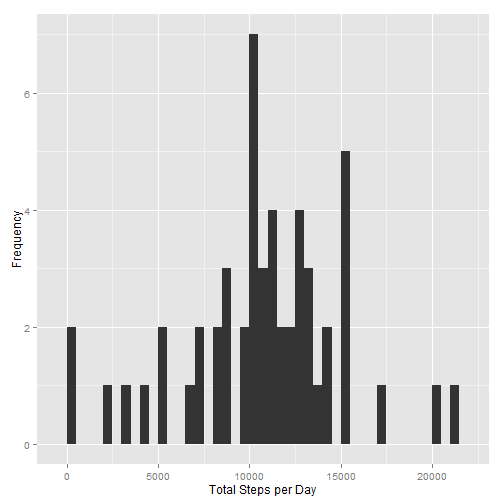
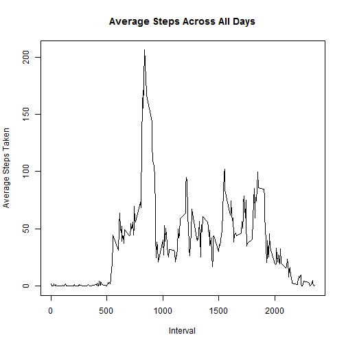
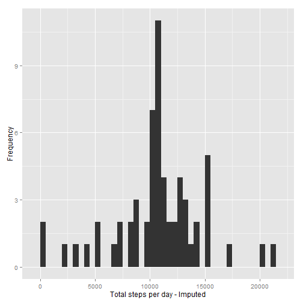
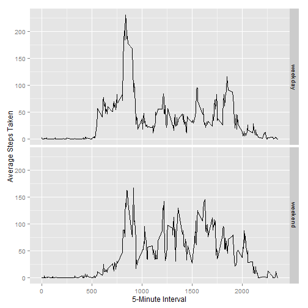

## Load and Preprocess Data


```r
library(ggplot2)

data <- read.csv('activity.csv')

data$date <- as.Date(data$date, format = '%Y-%m-%d')
```

## What is mean total number of steps taken per day?

#### 1. Histogram of the total number of steps taken each day


```r
total_steps_per_day <- tapply(data$steps, data$date, sum)
qplot(total_steps_per_day, xlab = 'Total Steps per Day', ylab = 'Frequency', binwidth = 500)
```

 

#### 2. Calculate and report the mean and median total number of steps taken per day


```r
#Mean
mean_steps_per_day <- mean(total_steps_per_day, na.rm = TRUE)
print(mean_steps_per_day)
```

```
## [1] 10766.19
```

```r
#Median
median_steps_per_day <- median(total_steps_per_day, na.rm = TRUE)
print(median_steps_per_day)
```

```
## [1] 10765
```

## What is the average daily activity pattern?

#### 1. Make a time series plot of the 5-minute interval (x-axis) and the average number of steps taken, averaged across all days (y-axis)


```r
average_steps_across_days <- aggregate(steps ~ interval, data, mean)

plot(average_steps_across_days, type = "l", xlab="Interval", ylab="Average Steps Taken", main="Average Steps Across All Days")
```

 

#### 2. Which 5-minute interval, on average across all the days in the dataset, contains the maximum number of steps?


```r
max_steps_interval <- average_steps_across_days$interval[which.max(average_steps_across_days$steps)]
print(max_steps_interval)
```

```
## [1] 835
```

## Imputing missing values

#### 1. Calculate and report the total number of missing values in the dataset (i.e. the total number of rows with NAs)


```r
total_missing_values <- sum(!complete.cases(data))
print(total_missing_values)
```

```
## [1] 2304
```

#### 2. Devise a strategy for filling in all of the missing values in the dataset. The strategy does not need to be sophisticated. For example, you could use the mean/median for that day, or the mean for that 5-minute interval, etc.

*I used the mean per interval.*

#### 3. Create a new dataset that is equal to the original dataset but with the missing data filled in.


```r
imputed_data <- transform(data, steps = ifelse(is.na(data$steps), average_steps_across_days$steps[match(data$interval, average_steps_across_days$interval)], data$steps))
```

#### 4. Make a histogram of the total number of steps taken each day and Calculate and report the mean and median total number of steps taken per day. Do these values differ from the estimates from the first part of the assignment? What is the impact of imputing missing data on the estimates of the total daily number of steps?


```r
imputed_total_steps_per_day <- tapply(imputed_data$steps, imputed_data$date, sum)
qplot(imputed_total_steps_per_day, xlab = 'Total steps per day - Imputed', ylab = 'Frequency', binwidth = 500)
```

 

```r
#Calculate and report the mean
imputed_total_steps_per_day_mean <- mean(imputed_total_steps_per_day)
print(imputed_total_steps_per_day_mean)
```

```
## [1] 10766.19
```

```r
#Calculate and report the median
imputed_total_steps_per_day_median <- median(imputed_total_steps_per_day)
print(imputed_total_steps_per_day_median)
```

```
## [1] 10766.19
```

*The mean remains the same, but the median increases since every value that was NA is now equal to the mean.*

## Are there differences in activity patterns between weekdays and weekends?

#### 1. Create a new factor variable in the dataset with two levels - "weekday" and "weekend" indicating whether a given date is a weekday or weekend day.


```r
imputed_data$day_type <- ifelse(weekdays(imputed_data$date) %in%  c("Saturday", "Sunday"),'weekend','weekday')
```

#### 2. Make a panel plot containing a time series plot of the 5-minute interval (x-axis) and the average number of steps taken, averaged across all weekday days or weekend days (y-axis).


```r
average_steps_weekdays_weekends <- aggregate(steps ~ interval + day_type, imputed_data, mean)

panel_plot <- ggplot(average_steps_weekdays_weekends, aes(interval, steps))
panel_plot + geom_line() + facet_grid(day_type ~ .) + xlab("5-Minute Interval") + ylab("Average Steps Taken")
```

 

